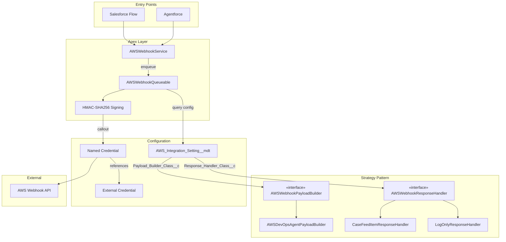

# AWS Webhook Apex Integration

A reusable Salesforce DX package that triggers HMAC-signed HTTP callouts to AWS webhooks from Flows and Agentforce. Uses a **Strategy Pattern** so each connected service can define its own payload structure and post-callout behavior without modifying the core engine.

## Architecture Overview



### How the Strategy Pattern works

1. Each Custom Metadata record stores two Apex class names: `Payload_Builder_Class__c` and `Response_Handler_Class__c`.
2. At runtime, `AWSWebhookQueueable` dynamically instantiates both classes via `Type.forName().newInstance()`.
3. The **payload builder** queries whatever records it needs and returns a JSON string.
4. The **response handler** receives the callout result and decides what to do (create a FeedItem, fire a Platform Event, just log, etc.).
5. To add a new service, you only need to implement the two interfaces and create a new Custom Metadata record -- zero changes to the core engine.

## Components

### Core Engine

| Class | Description |
| --- | --- |
| `AWSWebhookService.cls` | `@InvocableMethod` entry point. Validates inputs, enqueues the Queueable. |
| `AWSWebhookQueueable.cls` | Queueable callout engine. Reads config, delegates to builder/handler, signs & sends. |

### Interfaces

| Class | Description |
| --- | --- |
| `AWSWebhookPayloadBuilder.cls` | Interface -- `String buildPayload(Id recordId, String eventContext)` |
| `AWSWebhookResponseHandler.cls` | Interface -- `void handleResponse(Id recordId, Boolean isSuccess, String requestId, String message)` |

### Implementations (included)

| Class | Implements | Description |
| --- | --- | --- |
| `AWSDevOpsAgentPayloadBuilder.cls` | `AWSWebhookPayloadBuilder` | Queries a Case and builds an incident-style payload for the DevOps Agent. |
| `CaseFeedItemResponseHandler.cls` | `AWSWebhookResponseHandler` | Creates a FeedItem on the Case with the callout result (visible in Lightning Feed). |
| `LogOnlyResponseHandler.cls` | `AWSWebhookResponseHandler` | Writes `System.debug` logs only -- no DML. Useful during development or for fire-and-forget services. |

### Test Class

| Class | Description |
| --- | --- |
| `AWSWebhookServiceTest.cls` | Full coverage: invocable method, queueable execution, HMAC signing, payload builder, response handlers, dynamic `Type.forName` instantiation. |

### Custom Metadata Type: `AWS_Integration_Setting__mdt`

**Location:** `force-app/main/default/objects/AWS_Integration_Setting__mdt/`

| Field API Name | Type | Description |
| --- | --- | --- |
| `Endpoint_Named_Credential__c` | Text(100) | Named Credential API name (e.g., `AWS_Webhook`) |
| `Secret_Key__c` | Text(255) | HMAC secret key for signing |
| `Active__c` | Checkbox | Whether this config is active |
| `Webhook_Path__c` | Text(255) | Path appended to Named Credential endpoint |
| `Timeout_Milliseconds__c` | Number | HTTP timeout (default 30000) |
| `Payload_Builder_Class__c` | Text(255) | Apex class implementing `AWSWebhookPayloadBuilder` |
| `Response_Handler_Class__c` | Text(255) | Apex class implementing `AWSWebhookResponseHandler` |

### Flow

| Component | Description |
| --- | --- |
| `AWS_Trigger_Webhook_From_Case` | Screen Flow with confirmation, calls the `AWSWebhookService` Invocable Action, shows success/failure. |

### Permission Set

| Component | Description |
| --- | --- |
| `AWS_External_Credential_Principal_Access` | Grants access to the External Credential Principal for callouts. |

## HMAC-SHA256 Signature Implementation

```apex
private String generateSignature(String timestamp, String payload, String secret) {
    String dataToSign = timestamp + ':' + payload;
    Blob hmacData = Crypto.generateMac(
        'HmacSHA256',
        Blob.valueOf(dataToSign),
        Blob.valueOf(secret)
    );
    return EncodingUtil.base64Encode(hmacData);
}
```

Headers sent with every request:

| Header | Value |
| --- | --- |
| `Content-Type` | `application/json` |
| `x-amzn-event-timestamp` | ISO 8601 UTC timestamp |
| `x-amzn-event-signature` | Base64-encoded HMAC-SHA256 of `timestamp:payload` |

## Deployment

### Option 1: Deploy using the manifest (recommended)

```bash
sf project deploy start --manifest manifest/package.xml
sf project deploy start --manifest manifest/package.xml --target-org YOUR_ORG_ALIAS
```

### Option 2: Deploy using source format

```bash
sf project deploy start \
  --source-dir force-app/main/default/classes \
  --source-dir force-app/main/default/objects/AWS_Integration_Setting__mdt \
  --source-dir force-app/main/default/flows \
  --source-dir force-app/main/default/permissionsets
```

### Option 3: Validate first (dry run)

```bash
sf project deploy start --manifest manifest/package.xml \
  --dry-run --test-level RunSpecifiedTests --tests AWSWebhookServiceTest
```

### Run tests

```bash
sf apex run test --class-names AWSWebhookServiceTest --result-format human --wait 10
```

## Post-Deployment Configuration

### 1. Create External Credential

1. **Setup > Named Credentials > External Credentials tab > New**
2. Configure:
   - **Label:** AWS Webhook Auth
   - **Name:** `AWS_Webhook_Auth`
   - **Authentication Protocol:** Custom
3. Add a **Principal:**
   - **Parameter Name:** `AWS_Webhook_Principal`
   - **Sequence Number:** 1
   - **Identity Type:** Named Principal

### 2. Create Named Credential

1. **Setup > Named Credentials > Named Credentials tab > New**
2. Configure:
   - **Label:** AWS Webhook
   - **Name:** `AWS_Webhook`
   - **URL:** `https://your-api-gateway.amazonaws.com` (base URL, no trailing slash)
   - **Enabled for Callouts:** Checked
   - **External Credential:** `AWS_Webhook_Auth`
   - **Generate Authorization Header:** Unchecked

### 3. Configure Permission Set Access

1. **Setup > Permission Sets** > select or create one
2. **External Credential Principal Access** > add `AWS_Webhook_Auth - AWS_Webhook_Principal`
3. Assign the Permission Set to integration users

### 4. Create Custom Metadata Record

1. **Setup > Custom Metadata Types > AWS Integration Setting > Manage Records > New**
2. Configure:

| Field | Value |
| --- | --- |
| **Label** | AWS DevOps Agent |
| **DeveloperName** | `AWS_DevOps_Agent` |
| **Endpoint Named Credential** | `AWS_Webhook` |
| **Secret Key** | *(your HMAC secret)* |
| **Webhook Path** | `/webhook/your-endpoint-path` |
| **Active** | Checked |
| **Timeout Milliseconds** | `30000` |
| **Payload Builder Class** | `AWSDevOpsAgentPayloadBuilder` |
| **Response Handler Class** | `CaseFeedItemResponseHandler` |

## Adding a New Service

To connect a new AWS service with its own payload and response behavior:

### Step 1: Create a Payload Builder

```apex
public class MyNewPayloadBuilder implements AWSWebhookPayloadBuilder {
    public String buildPayload(Id recordId, String eventContext) {
        // Query whatever records you need
        // Build and return your JSON payload
        Map<String, Object> payload = new Map<String, Object>();
        payload.put('eventType', eventContext);
        // ... your custom fields ...
        return JSON.serialize(payload);
    }
}
```

### Step 2: Create a Response Handler (or reuse an existing one)

```apex
public class MyNewResponseHandler implements AWSWebhookResponseHandler {
    public void handleResponse(Id recordId, Boolean isSuccess, String requestId, String message) {
        // Create a Task, send an email, fire a Platform Event, etc.
    }
}
```

### Step 3: Create a Custom Metadata Record

| Field | Value |
| --- | --- |
| **DeveloperName** | `My_New_Service` |
| **Payload Builder Class** | `MyNewPayloadBuilder` |
| **Response Handler Class** | `MyNewResponseHandler` |
| *(fill remaining fields)* | *(endpoint, secret, path, etc.)* |

### Step 4: Invoke from Flow

Pass `configurationName = "My_New_Service"` to the Invocable Action. The core engine handles the rest.

## Flow Integration

The Invocable Action appears in Flow Builder as:

- **Category:** Apex Action
- **Label:** "Trigger AWS Webhook"

**Inputs:**

| Parameter | Required | Description |
| --- | --- | --- |
| `recordId` | Yes | The record ID to process |
| `context` | Yes | Event context (e.g., `CaseCreate`, `ManualTrigger`) |
| `configurationName` | No | Custom Metadata DeveloperName (defaults to `AWS_DevOps_Agent`) |

**Outputs:** `isSuccess`, `message`, `jobId`

## Agentforce Action Configuration

The `AWSWebhookService.triggerWebhook` invocable method is available as an Agentforce action. Configure it so agents can trigger webhooks from conversation (e.g., "Send this case to AWS" or "Escalate to the DevOps Agent").

### 1. Create an Agent Action in Setup

1. Go to **Setup > Agent Assets > Actions**
2. Click **New Agent Action**
3. Configure:
   - **Reference Action Type:** Apex
   - **Reference Action Category:** Invocable Methods
   - **Reference Action:** `AWSWebhookService.triggerWebhook`
   - **Agent Action Label:** e.g., `Trigger AWS Webhook` (or keep default)
   - **API Name:** e.g., `Trigger_AWS_Webhook`

Instruction fields are pre-populated from the Apex `@InvocableMethod` and `@InvocableVariable` descriptions.

### 2. Add the Action to Your Agent

1. Open **Agent Builder** (Setup > Agent Builder or the Agentforce app)
2. Select or create an agent
3. Go to **This Copilot's Actions** (or equivalent tab)
4. Add the custom action from the **Copilot Action Library**
5. Save the agent

### 3. Configure Agent Instructions (Recommended)

Add instructions so the agent knows when to use the action, for example:

- "When the user asks to send a Case to AWS, trigger the DevOps webhook, or escalate to the DevOps Agent, use the Trigger AWS Webhook action."
- "Pass the current Case ID as the Record ID and an appropriate context (e.g., `CaseCreate`, `CaseUpdate`, `ManualTrigger`)."

### 4. Action Inputs and Context

| Input | Required | Description |
| --- | --- | --- |
| `recordId` | Yes | Case or record ID (from conversation context or user-provided) |
| `context` | Yes | Event context (e.g., `CaseCreate`, `CaseUpdate`, `ManualTrigger`) |
| `configurationName` | No | Custom Metadata DeveloperName (defaults to `AWS_DevOps_Agent`) |

Agentforce can pass record context when the user is on a record page. Ensure the agent has access to record context and that instructions describe how to map user intent to `context` values.

### 5. Optional: Source-Controlled Agent Action Metadata

Agent Actions use the **GenAiFunction** metadata type. To version the action configuration:

1. Create the action in Setup (steps 1–2 above)
2. Retrieve: `sf project retrieve start -m GenAiFunction`
3. Commit the generated metadata for CI/CD deployment

## Security Considerations

- **No hardcoded secrets:** HMAC secret stored in Custom Metadata, retrieved at runtime
- **No hardcoded URLs:** Endpoint resolved via Named Credential
- **External Credential isolation:** Authentication separated from endpoint configuration
- **Permission Set controlled:** Only users with External Credential Principal can make callouts
- **HMAC validation:** AWS validates the signature to ensure request authenticity
- **Audit trail:** Named Credential callouts are logged in Salesforce event monitoring

## API Version

All components use Salesforce API version **66.0**.

## Project Structure

```
salesforce-aws-webhook/
├── force-app/main/default/
│   ├── classes/
│   │   ├── AWSWebhookService.cls                  # Invocable entry point
│   │   ├── AWSWebhookQueueable.cls                # Callout engine
│   │   ├── AWSWebhookPayloadBuilder.cls           # Payload builder interface
│   │   ├── AWSWebhookResponseHandler.cls          # Response handler interface
│   │   ├── AWSDevOpsAgentPayloadBuilder.cls       # DevOps Agent payload builder
│   │   ├── CaseFeedItemResponseHandler.cls        # FeedItem response handler
│   │   ├── LogOnlyResponseHandler.cls             # Log-only response handler
│   │   ├── AWSWebhookServiceTest.cls              # Test class
│   │   └── *.cls-meta.xml                         # Meta XMLs (API v66.0)
│   ├── flows/
│   │   └── AWS_Trigger_Webhook_From_Case.flow-meta.xml
│   ├── objects/
│   │   └── AWS_Integration_Setting__mdt/
│   │       ├── AWS_Integration_Setting__mdt.object-meta.xml
│   │       └── fields/
│   │           ├── Active__c.field-meta.xml
│   │           ├── Endpoint_Named_Credential__c.field-meta.xml
│   │           ├── Payload_Builder_Class__c.field-meta.xml
│   │           ├── Response_Handler_Class__c.field-meta.xml
│   │           ├── Secret_Key__c.field-meta.xml
│   │           ├── Timeout_Milliseconds__c.field-meta.xml
│   │           └── Webhook_Path__c.field-meta.xml
│   └── permissionsets/
│       └── AWS_External_Credential_Principal_Access.permissionset-meta.xml
├── manifest/
│   └── package.xml
├── scripts/
│   ├── apex/
│   │   ├── check-job-status.apex
│   │   ├── test-aws-webhook.apex
│   │   └── verify-aws-config.apex
│   └── sh/
│       ├── test_bash.sh
│       ├── test_webhook.sh
│       └── trigger_devops_webhook.sh
├── sfdx-project.json
└── README.md
```
