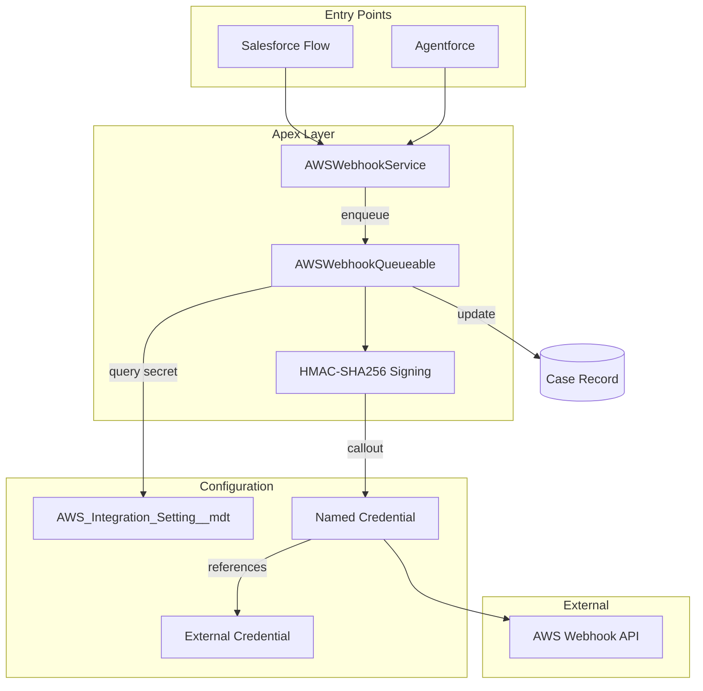
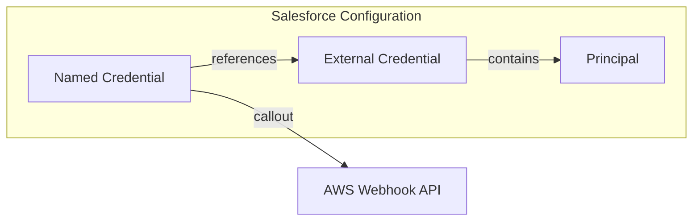

# AWS Webhook Apex Integration

Create an Apex integration service with an Invocable entry point that triggers a Queueable job to call an AWS Webhook with HMAC-SHA256 signature authentication, using Named Credentials and Custom Metadata for secure credential management.

## Architecture Overview



## Components

### 1. Apex Class: `AWSWebhookService.cls`

**Location:** `force-app/main/default/classes/AWSWebhookService.cls`

This class contains:

- **Inner class `WebhookRequest`** with `@InvocableVariable` annotations:
  - `recordId` (String, required) - The Case or record ID
  - `context` (String, required) - Event context like "CaseCreate" or "CaseUpdate"
  - `configurationName` (String, optional) - Custom Metadata DeveloperName, defaults to "AWS_DevOps_Agent"
- **Inner class `WebhookResult`** for Flow output:
  - `isSuccess` (Boolean)
  - `message` (String)
  - `jobId` (String)
- **`@InvocableMethod` method** `triggerWebhook(List<WebhookRequest> requests)`:
  - Validates inputs
  - Instantiates and enqueues `AWSWebhookQueueable`
  - Returns job ID for tracking

### 2. Apex Class: `AWSWebhookQueueable.cls`

**Location:** `force-app/main/default/classes/AWSWebhookQueueable.cls`

Implements `Queueable, Database.AllowsCallouts`:

- **Constructor** accepts `recordId`, `context`, `configurationName`
- **`execute(QueueableContext context)`** method:
  1. Query `AWS_Integration_Setting__mdt` to get secret and Named Credential name
  2. Query Case record to build payload
  3. Generate ISO 8601 timestamp
  4. Build JSON payload with Case data
  5. Create HMAC-SHA256 signature: `sign(timestamp + ":" + payload, secret)`
  6. Make HTTP callout using `callout:` + Named Credential
  7. Set custom headers: `x-amzn-event-timestamp`, `x-amzn-event-signature`
  8. Parse response and update Case with integration log
- **Private helper methods:**
  - `generateSignature(String timestamp, String payload, String secret)` - HMAC-SHA256 logic
  - `buildPayload(Case caseRecord, String context)` - JSON payload construction
  - `updateCaseWithResult(Id caseId, String requestId, Boolean isSuccess, String message)` - Write-back logic

### 3. Custom Metadata Type: `AWS_Integration_Setting__mdt`

**Location:** `force-app/main/default/objects/AWS_Integration_Setting__mdt/`

**Fields:**

| Field API Name                 | Type      | Description                                     |
| ------------------------------ | --------- | ----------------------------------------------- |
| `Endpoint_Named_Credential__c` | Text(100) | Named Credential API name (e.g., "AWS_Webhook") |
| `Secret_Key__c`                | Text(255) | HMAC secret key for signing                     |
| `Active__c`                    | Checkbox  | Whether this config is active                   |
| `Webhook_Path__c`              | Text(255) | Path appended to Named Credential endpoint      |
| `Timeout_Milliseconds__c`      | Number    | HTTP timeout (default 30000)                    |

### 4. Test Class: `AWSWebhookServiceTest.cls`

**Location:** `force-app/main/default/classes/AWSWebhookServiceTest.cls`

- Mock HTTP callouts using `HttpCalloutMock`
- Test invocable method with valid/invalid inputs
- Test Queueable execution with mock responses
- Verify Case update after callout

## HMAC-SHA256 Signature Implementation

The Bash script logic translates to Apex as follows:

```apex
// Bash: SIGNATURE=$(echo -n "${TIMESTAMP}:${PAYLOAD}" | openssl dgst -sha256 -hmac "$SECRET" -binary | base64)

private String generateSignature(String timestamp, String payload, String secret) {
    String dataToSign = timestamp + ':' + payload;
    Blob hmacData = Crypto.generateMac(
        'HmacSHA256',
        Blob.valueOf(dataToSign),
        Blob.valueOf(secret)
    );
    return EncodingUtil.base64Encode(hmacData);
}
```

## Deployment Commands

### Option 1: Deploy using source format (recommended)

Deploy directly from the source files:

```bash
# Deploy to your default org
sf project deploy start --source-dir force-app/main/default/classes/AWSWebhookService.cls \
  --source-dir force-app/main/default/classes/AWSWebhookQueueable.cls \
  --source-dir force-app/main/default/classes/AWSWebhookServiceTest.cls \
  --source-dir force-app/main/default/objects/AWS_Integration_Setting__mdt

# Deploy to a specific org
sf project deploy start --source-dir force-app/main/default/classes/AWSWebhookService.cls \
  --source-dir force-app/main/default/classes/AWSWebhookQueueable.cls \
  --source-dir force-app/main/default/classes/AWSWebhookServiceTest.cls \
  --source-dir force-app/main/default/objects/AWS_Integration_Setting__mdt \
  --target-org YOUR_ORG_ALIAS
```

### Option 2: Deploy using the manifest (package.xml)

```bash
# Deploy using the package.xml manifest
sf project deploy start --manifest manifest/package.xml

# Deploy to a specific target org
sf project deploy start --manifest manifest/package.xml --target-org YOUR_ORG_ALIAS
```

### Option 3: Validate first (dry run)

```bash
# Validate without deploying (runs tests)
sf project deploy start --manifest manifest/package.xml --dry-run --test-level RunSpecifiedTests --tests AWSWebhookServiceTest
```

### Run tests after deployment

```bash
sf apex run test --class-names AWSWebhookServiceTest --result-format human --wait 10
```

## Post-Deployment Configuration

The new Named Credentials framework (Spring '23+) separates authentication configuration from endpoint configuration using External Credentials and Named Credentials.



### 1. Create External Credential

The External Credential defines the authentication protocol. Since HMAC signing is handled in Apex, we use "Custom" authentication.

1. Navigate to: **Setup > Named Credentials > External Credentials tab > New**
2. Configure:
   - **Label:** AWS Webhook Auth
   - **Name:** AWS_Webhook_Auth
   - **Authentication Protocol:** Custom
3. Click **Save**
4. In the **Principals** section, click **New**:
   - **Parameter Name:** AWS_Webhook_Principal
   - **Sequence Number:** 1
   - **Identity Type:** Named Principal
5. Click **Save**
6. In the **Permission Set Mappings** section, assign the Principal to appropriate Permission Sets that need callout access

### 2. Create Named Credential

The Named Credential defines the endpoint URL and references the External Credential.

1. Navigate to: **Setup > Named Credentials > Named Credentials tab > New**
2. Configure:
   - **Label:** AWS Webhook
   - **Name:** AWS_Webhook (this is referenced in Custom Metadata)
   - **URL:** `https://event-ai.us-east-1.api.aws` (base URL only, no trailing slash)
   - **Enabled for Callouts:** Checked
   - **External Credential:** AWS_Webhook_Auth (select from dropdown)
   - **Generate Authorization Header:** Unchecked (HMAC signature handled in Apex)
   - **Allow Formulas in HTTP Header:** Checked (optional, for dynamic headers)
   - **Allow Formulas in HTTP Body:** Unchecked
3. Click **Save**

### 3. Configure Permission Set Access

Users and integrations that need to make callouts must have access to the External Credential Principal.

1. Navigate to: **Setup > Permission Sets**
2. Select or create a Permission Set for integration users
3. Go to **External Credential Principal Access**
4. Add **AWS_Webhook_Auth - AWS_Webhook_Principal**
5. Assign the Permission Set to users/integration users who will trigger webhooks

### 4. Create Custom Metadata Record

1. Navigate to: **Setup > Custom Metadata Types > AWS Integration Setting > Manage Records**
2. Click **New**
3. Configure:
   - **Label:** Default
   - **DeveloperName:** Default
   - **Endpoint Named Credential:** AWS_Webhook
   - **Secret Key:** (your HMAC secret from AWS)
   - **Webhook Path:** /webhook/your-endpoint-path
   - **Active:** Checked
   - **Timeout Milliseconds:** 30000
4. Click **Save**

### Alternative: Using AWS Signature Version 4 (Optional)

If your AWS endpoint requires AWS Signature Version 4 instead of custom HMAC, you can configure the External Credential differently:

1. **External Credential Settings:**
   - **Authentication Protocol:** AWS Signature Version 4
   - **Service:** execute-api (for API Gateway) or your specific AWS service
   - **Region:** us-east-1 (or your region)
   - **AWS Account ID:** Your AWS account ID

2. **Principal Settings:**
   - **Identity Type:** Named Principal
   - **Authentication Parameters:**
     - **Access Key:** Your AWS Access Key ID
     - **Access Secret:** Your AWS Secret Access Key

> **Note:** When using AWS Sig V4 via External Credentials, you would not need the HMAC signing logic in Apex as Salesforce handles the signing automatically.

## Flow Integration

The Invocable Action will appear in Flow Builder as:

- **Category:** Apex Action
- **Label:** "Trigger AWS Webhook"

**Flow Configuration:**

1. Add an Apex Action element
2. Select "Trigger AWS Webhook"
3. Map inputs:
   - `recordId` -> Record Id from trigger or variable
   - `context` -> Text literal like "CaseUpdate"
   - `configurationName` -> (Optional) "AWS_DevOps_Agent"
4. Capture outputs for logging/debugging

## Security Considerations

- **No hardcoded secrets:** HMAC secret retrieved from Custom Metadata at runtime
- **No hardcoded URLs:** Endpoint resolved via Named Credential
- **External Credential isolation:** Authentication configuration is separated from endpoint configuration
- **Permission Set controlled access:** Only users with the External Credential Principal assigned can make callouts
- **Field-level security:** Ensure Custom Metadata field `Secret_Key__c` is only accessible to system administrators
- **HMAC validation:** AWS can validate the signature to ensure request authenticity
- **Audit trail:** Named Credential callouts are logged in Salesforce event monitoring
